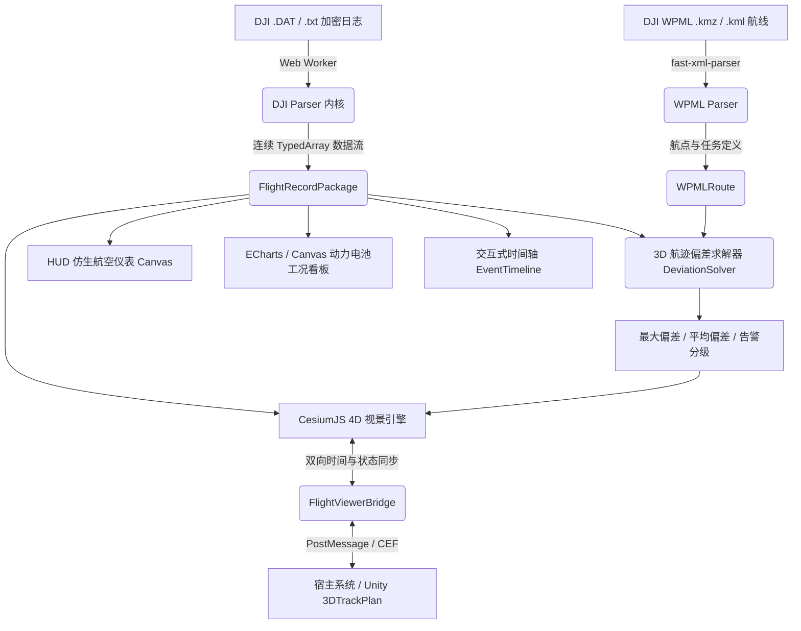

# DJI 行业无人机航巡时空研判与回放平台 (DJI Flight Log Spatiotemporal 3D Viewer)

> 面向电网输电线路巡检、变电站精细化巡检与工程级无人机时空研判的下一代 Web 3D 飞行日志回放系统。纯浏览器端离线运算、毫米级时空同步与全方位机载遥测态势研判。

---

## 🌟 核心特性与架构设计

### 1. 100% 纯离线高安全架构 (Zero-Network Offline Security)
- **零外部请求**：日志解密、遥测解包、时空三维投影与图表分析 100% 在客户端浏览器（Web Worker / Canvas / WebGL）本地执行，严禁外发任何网络请求。
- **零线上 Token 依赖**：CesiumJS 视景引擎彻底解耦 Cesium Ion 与线上瓦片依赖，内置深色网格大地参考基准与离线椭球投影。

### 2. 行业级加密日志本地解包内核 (Offline Cryptographic & Parser Engine)
- **多机型兼容**：原生支持 DJI Pilot 2、大疆经纬 M300 RTK、M350 RTK、M30 系列与 Mavic 3 行业版日志格式。
- **本地 AES 解密与多流解包**：纯本地实现 AES-128-CBC 校验解密，高速解构 OSD 飞控遥测、RTK 差分定位状态、双动力电池多路电芯、三轴云台、照片曝光事件及故障告警日志。
- **高效零拷贝 TypedArray 存储**：所有遥测时序数据均采用 `Float64Array` / `Float32Array` / `Uint8Array` 连续平坦化内存组织，百兆级日志毫秒级加载，内存开销降低 80%。

### 3. DJI WPML 航线空间拓扑与 3D 航偏比对求解器 (3D Spatial Deviation Solver)
- **WPML 规范解析**：支持标准 DJI WPML KML / KMZ 航线规划任务解析（航点坐标、航速、动作序列）。
- **3D 投影与偏航计算**：基于 WGS-84 大地切平面空间投影，实时求解航迹与规划航线的三维欧氏空间最近距离、法向偏航距与高度差。
- **色阶航迹渲染**：支持按 RTK 精度（固定解/浮点解/单点解）、地速梯度、海拔/相对高度及航偏告警进行多色阶三维动态管线渲染。

### 4. CesiumJS 4D 时空视景与 6-DOF 姿态回放 (Cesium 4D Viewport Engine)
- **6-DOF 航机姿态插值**：采用四元数与欧拉角变换实现高保真度机体俯仰 (Pitch)、横滚 (Roll) 与偏航 (Yaw) 的 60 FPS 平滑连续姿态插值。
- **多相机跟踪视角**：支持伴随跟踪视角 (Follow)、自由漫游视角 (Free)、正射俯视视角 (Top-Down) 与机载云台第一视角 (FPV Gimbal)。
- **动态云台视锥与地表足印投影**：纯几何向量求解相机光轴与地面切平面的交汇足印，实时绘制 3D 视锥体与地表投影多边形，仰天/水平边界自动截断。

### 5. 仿生飞行 HUD 仪表与双电池工况联动看板 (HUD Avionics & Telemetry Dashboard)
- **专业航空仪表 (Canvas HUD)**：实时绘制人工地平仪 (Attitude Indicator)、俯仰梯阶 (Pitch Ladder)、滚转指针、空速与高度滚动视带 (Speed & Altitude Tapes) 及罗盘方位丝带 (Heading Ribbon)。
- **双电池电芯健康研判**：自动检测电芯最大压差，严格对照大疆行业机巡规范（压差 > 50mV 触发告警标注），实时分析电池衰减与高内阻隐患。
- **多维度时间光标联动**：视景回放、HUD 仪表、时序曲线与底部事件时间轴双向无缝对齐。

### 6. 插件化嵌入 SDK 与 Unity (3DTrackPlan) 桥接适配器 (Bridge SDK & Unity Adapter)
- **双向消息协议**：支持在 iframe、WebView2、CEF 宿主中无缝嵌入，通过标准化命令与事件（`LOAD_FLIGHT`、`PLAY`、`SEEK`、`TIME_UPDATE` 等）实现跨系统协同。
- **Unity 3DTrackPlan 生产级适配**：内置 `FlightViewerBridgeController.cs`，适配 Vuplex 3D WebView 与 CEF，已完成 DJI 航空姿态与 Unity 左手系空间轴向精确映射。

---

## 📐 系统架构与数据流图



---

## 🚀 快速上手 (Quick Start)

### 依赖环境
- Node.js 18+ 或 20+
- npm 或 pnpm

### 安装依赖
```bash
npm install
```

### 本地开发调试
```bash
npm run dev
```
打开浏览器访问 `http://localhost:3000`，系统将自动加载杭州某 500kV 输电线路巡检的内置演示日志，即可立即体验三维回放与仪表联动。

### 运行完整自动化测试套件
```bash
npm run test
```
包含 10 个测试套件，涵盖核心类型、解密算法、航偏求解、视锥投影、HUD 仪表、Bridge 通信协议与端到端总装集成。

### 生产环境打包构建
```bash
npm run build
```
输出优化后的离线静态产物至 `dist/` 目录。

---

## 📂 项目工程目录结构

```
FlightManager/
├── index.html                   # 主应用单页面入口
├── vite.config.ts               # Vite 构建与 Cesium 插件配置
├── tsconfig.json                # TypeScript 编译器配置
├── package.json                 # 依赖契约与脚本定义
├── src/
│   ├── main.ts                  # 应用主入口与总装集成协调器
│   ├── style.css                # 航空座舱深色现代主题样式表
│   ├── core/                    # 核心数据契约与 TypedArray 结构
│   │   ├── types.ts             # 飞行记录、遥测流、事件、偏差接口契约
│   │   └── index.ts
│   ├── parser/                  # 离线解密与遥测解包模块
│   │   ├── cryptoUtils.ts       # Web Crypto API AES-128-CBC 校验解密
│   │   ├── djiParser.ts         # DJI Pilot 2 二进制记录解析器与 Mock 生成器
│   │   ├── wpmlParser.ts        # DJI WPML (KML/KMZ) 航线规划解析器
│   │   └── parserWorker.ts      # Web Worker 异步多线程解析封装
│   ├── spatial/                 # 空间几何与数学求解算法
│   │   ├── deviationSolver.ts   # 3D 空间轨迹与航线最近距离与偏差求解
│   │   └── frustumSolver.ts     # 云台动态相机视锥与地表足印投影
│   ├── viewport/                # CesiumJS 三维视景渲染层
│   │   ├── cesiumViewer.ts      # 4D 时空视景引擎与 6-DOF 姿态插值
│   │   ├── trajectoryLayer.ts   # 多色阶航迹管线分段渲染
│   │   └── frustumLayer.ts      # 视锥体线框与地表多边形动态图层
│   ├── dashboard/               # 飞行仪表与遥测数据看板
│   │   ├── hudInstruments.ts    # Canvas 人工地平仪与航空飞行仪表
│   │   ├── telemetryCharts.ts   # 电池压差异常检测与图表参数构建
│   │   ├── eventTimeline.ts     # 交互式时间轴、拍照点与告警事件标记
│   │   └── hudDashboard.ts      # 仪表与看板统一调度器
│   └── bridge/                  # 嵌入 SDK 与 Unity 适配器
│       ├── flightViewerBridge.ts# 双向 PostMessage 通信桥梁
│       └── unityBridgeDemo.cs   # Unity 3DTrackPlan C# 生产级适配脚本
└── tests/                       # 全量 Vitest 自动化单元与集成测试
    ├── core/
    ├── parser/
    ├── spatial/
    ├── viewport/
    ├── dashboard/
    ├── bridge/
    └── e2e/                     # 端到端总装集成验收测试
```

---

## 🎮 操控指南 (User Operations)

| 操作项目 | 快捷方式 / 控件 | 行为说明 |
| :--- | :--- | :--- |
| **播放 / 暂停** | `Space` 空格键 / 底部主按钮 | 切换三维视景与全仪表的时空连续回放 |
| **快进 / 快退** | 方向键 `←` / `→` | 前进或后退 5 秒并同步刷新视锥与仪表 |
| **时间轴拖拽** | 底部时间轴直接拖拽光标 | 快速定位至指定时间或照片拍摄/告警点 |
| **视角跟踪切换** | 右上方“视角”下拉菜单 | 伴随跟踪 (Follow) / 自由漫游 (Free) / 正射俯视 / 机载云台 (FPV) |
| **航迹色彩编码** | 右上方“航迹着色”下拉菜单 | 按 RTK 精度、地速梯度、海拔高度或 WPML 航线偏差着色 |
| **云台视锥开关** | 右上方“云台视锥”按钮 | 开启或关闭相机视锥体与地表足印投影 |
| **居中复位** | 右上方“居中”按钮 | 相机自动对焦并平滑飞向整段航线包围盒 |
| **遥测看板抽屉** | 顶部“遥测看板”按钮 | 展开右侧动力电池多电芯压差与动度曲线看板 |
| **日志与航线加载** | 顶部按钮 / 全局拖放文件 | 支持拖拽 `.DAT`、`.txt`、`.kmz`、`.kml` 即刻离线解析 |

---

## 📄 许可与开源规范
- **开发语言**：生产代码、注释、变量名均遵守规范英文/中英双语；UI 提示与报告输出为中文。
- **协议**：MIT License.
